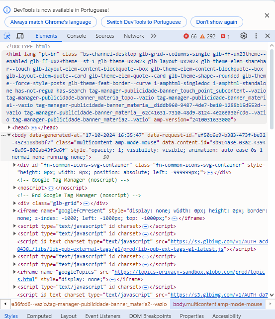
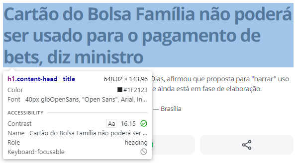
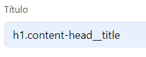
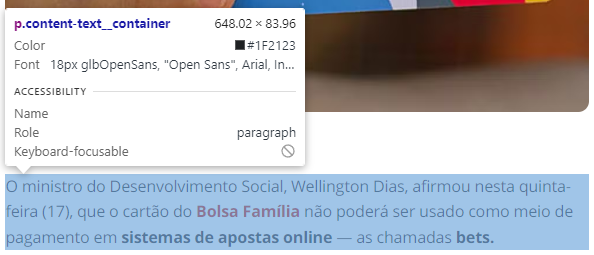

# Arquivo de Informações para Testes de Raspagem

Este documento contém informações de teste para a configuração do sistema de raspagem de portais e APIs. As informações incluem os seletores HTML necessários para extrair os dados dos portais de notícias e os endpoints das requisições das APIs. 

### _O usuário deve cadastrar cada portal com os seletores corretos para que a raspagem funcione corretamente._

Primeiramente, escolha o portal de sua preferência e digite sua URL no navegador. Ao carregar a página inicial, clique simuntâneamente nas teclas Ctrl + Shift + I ou Ctrl + Shift + C para inspecionar a página. 

Uma tela vai aparecer no lado direito e contém algumas informações que precisamos. Para localizá-las com mais facilidade, precisamos clicar no ícone 

Para a inspeção dos elementos que precisamos, basta passar o mouse sobre cada um deles e verificar qual seletor retorna. Observe abaixo o exemplo, passando o mouse sobre o título da notícia:

Ou seja, para o cadastro de seletor de título, será `h1.content-head__title`

Mais um exemplo é o seletor de Conteúdo que, ao inspecionar, nos mostra `p.content-text__container`

# Exemplos de Cadastro

## 1. Canal Rural

- **URL**: [https://www.canalrural.com.br](https://www.canalrural.com.br)
- **Caminho da Lista de Notícias**: `feed-link`
- **Título**: `h1.content-title`
- **Jornalista**: `p.content-author`
- **Conteúdo**: `div.single-content`
- **Data da Publicação da Notícia**: `time`

## 2. G1

- **URL**: [https://g1.globo.com](https://g1.globo.com)
- **Caminho da Lista de Notícias**: `feed-post-link`
- **Título**: `h1.content-head__title`
- **Jornalista**: `p.content-publication-data__from`
- **Conteúdo**: `p.content-text__container`
- **Data da Publicação da Notícia**: `time`

## 3. G1 - Agro

- **URL**: [https://g1.globo.com/economia/agronegocios/](https://g1.globo.com/economia/agronegocios/)
- **Caminho da Lista de Notícias**: `feed-post-link`
- **Título**: `h1.content-head__title`
- **Jornalista**: `p.content-publication-data__from`
- **Conteúdo**: `p.content-text__container`
- **Data da Publicação da Notícia**: `time`

> **Nota**: O G1 - Agro compartilha os mesmos seletores HTML que o portal G1, mas está focado em notícias do setor agro. Pode haver duplicação de notícias entre os dois portais se uma notícia sobre o agronegócio aparecer na página principal do G1. Este portal é ideal para testes de verificação de duplicidade.

---

**Instruções para uso**:  
1. Copie as informações acima para configurar os seletores no sistema.
2. Certifique-se de que os seletores estejam corretos antes de iniciar o processo de raspagem.
3. Utilize os exemplos de URLs para validar se a extração dos dados está ocorrendo conforme esperado.

APIs de Teste
Aqui estão algumas APIs REST de exemplo que podem ser utilizadas para testar o sistema. Cada uma delas é acessível sem necessidade de autenticação.

APIs em XML
IBGE - Localidades

Endpoint: https://servicodados.ibge.gov.br/api/v1/localidades/estados/RR/municipios?formato=xml
Descrição: Retorna uma lista de municípios do estado de Roraima em formato XML.
Tipo de Arquivo: XML

ViaCEP - Consulta de CEP

Endpoint: https://viacep.com.br/ws/12247014/xml/
Descrição: Consulta de endereço a partir do CEP informado. Neste exemplo, é usado o CEP da FATEC.
Tipo de Arquivo: XML

W3Schools - XML Note

Endpoint: https://www.w3schools.com/xml/note.xml
Descrição: Exemplo de um documento XML simples contendo uma nota.
Tipo de Arquivo: XML
OpenWeatherMap - Dados Climáticos (XML)

Endpoint: https://samples.openweathermap.org/data/2.5/weather?q=London&mode=xml&appid=b1b15e88fa797225412429c1c50c122a1
Descrição: Retorna dados climáticos básicos para a cidade de Londres em formato XML.
Tipo de Arquivo: XML
NBP - Taxas de Câmbio (Tabela A)

Endpoint: http://api.nbp.pl/api/exchangerates/tables/A?format=xml
Descrição: Retorna as taxas de câmbio do Banco Nacional da Polônia em formato XML.
Tipo de Arquivo: XML
APIs em CSV
IPCA Mensal - Banco Central

Endpoint: https://api.bcb.gov.br/dados/serie/bcdata.sgs.433/dados?formato=csv
Descrição: Retorna o Índice de Preços ao Consumidor Amplo (IPCA) de um mês específico em formato CSV.
Tipo de Arquivo: CSV
Sample Data - Weight and Height

Endpoint: https://people.sc.fsu.edu/~jburkardt/data/csv/hw_200.csv
Descrição: Exemplo de arquivo CSV com dados de altura e peso.
Tipo de Arquivo: CSV
APIs em JSON
PokeAPI - Pokémon Data

Endpoint: https://pokeapi.co/api/v2/pokemon
Descrição: Retorna dados sobre diversos Pokémon, como nome, tipos e habilidades, em formato JSON.
Tipo de Arquivo: JSON
JSONPlaceholder - Posts

Endpoint: https://jsonplaceholder.typicode.com/posts
Descrição: API de testes que retorna uma lista de posts fictícios em formato JSON.
Tipo de Arquivo: JSON

PYG-17/PYG-39/fix/consulta-noticias-por-data-com-fuso